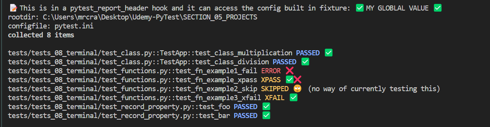

# The Pytest Cookbook - *recipes with videos and repos*

## Purpose of this book 

To provide a number of ready built and congfigurable FULL STACK PYTHON TEST FRAMEWORK, (PFS),comprising of over 200 highly commented test templates for developers to adapt to their own needs along with resource links that have helped me greatly, as well as integration of these into the frameworks.

The PyTest Full Stack suite has an installation tat will just require a 1-2-3 of:
   
1. `pip install -r requirements.txt`.
2. `playwright install` to load Playwright browsers.
3. `python -m pytest -v` to run over 200 tests.

PFS uses a number of hooks for utilities and featues.

One of these is customising the terminal report and one can configure the output in a number of ways, explained in articles and videos.

Here is a sample output:

## Custome header sections


## Customised words, colours and icons



## Custom footer sections


The frameworks have logging and other utilities installed to provide a complete framework.

Resources included are:

1. Links to helpful articles, videos and documentation. 
2. Converted and transcribed code of great YT videos where there is no code.

## Test frameworks

*See the README.md in root of each Test framework for detailed and up to date set up instructions.*

These two main test frameworks:

- PyTest_01_Full - a full stack testing framework from SQL Schemas to E2E testing with Playwright
- PyTest_02_DJANGO - is its own unique testing framework built from a range of sources. (Under construction and will be a PyTest-Full-Stack test suite for Django).

I strive to acknowledge sources I have used to learn PyTest and any adaptations of code samples used therein.

As a curated list of resources, I have integrity over linking to the work of others and due credits are given.

Often I am a wrapper around someone else's effort and I try to add a different presentation whre possible as we each find our understanding with a different presentation of the subject. Hence having may teachers enables us all as eternal students to get our heads around sometimes very complex subjects.

## About me

I am a Python Test Engineer using PyTest and Playwright as well as a Software Tester and Django developer.

I enjoy building Plugins and I have created a PyTest Hooks and Plugin online video course that teaches how to create lite versions of some well known plugins as well as our own useful custom plugins which can be made distributabe:

Example plugins are:

- CSV Lite Reporter
- Export results to DB
- Sorting, randomizing and deselecting tests
- Customising the console report with colors and icons

The course is available [Udemy Hooks and Plugins course](https://www.udemy.com/course/pytest-cookbook-using-hooks-to-create-custom-plugins/) and Udemy has a sale ever two weeks and the cost would be $20 USD approx.


There is more information about me and my services [here](https://pytest-cookbook.netlify.app/craig/).

## How best to use this book


For PyTest-Full-Stack framework:

Download or git clone from [repo](https://github.com/https://github.com/Python-Test-Engineer/PyTest-Full-Stack).

Follow installation instructuins in the README.md or the 1-2-3 of:

1. `pip install -r requirements.txt`.
2. `playwright install` to load Playwright browsers.
3. `python -m pytest -v` to run over 200 tests.

For prettier general console output, Rich and PyBoxen, built on Rich, are used.

PyTest-sugar, an excellent plugin, was used but with the inclusion of the pytest_terminal_summary hook in the conftest.py file of PyTest-Full-Stack, we have a coloruful and decorative console output that is configurable and customisable (see YouTube guide below).

## YouTube Videos

I have made some videos to assist in using this book.

These are available [here](https://www.youtube.com/playlist?list=PLsszRSbzjyvlrB6V5dacW6G8YrD_iW7oy){target="_blank"}.

<!-- 

==================================================================
## TODO

Django Tests

- https://www.photondesigner.com/articles/unit-tests-factory-boy-faker?ref=yt-unit-tests-factory-boy-faker

Testing middleware with `override_settings`

- https://www.youtube.com/watch?v=TTEEr4N-lKw


:flag_be: :heart: :arrow_right: 


```python
# Hello world example (Python)
print("Hello World!")
zero_to_
```

!!! note
 Example of a note.

!!! tip "Custom title"
 Example tip. -->