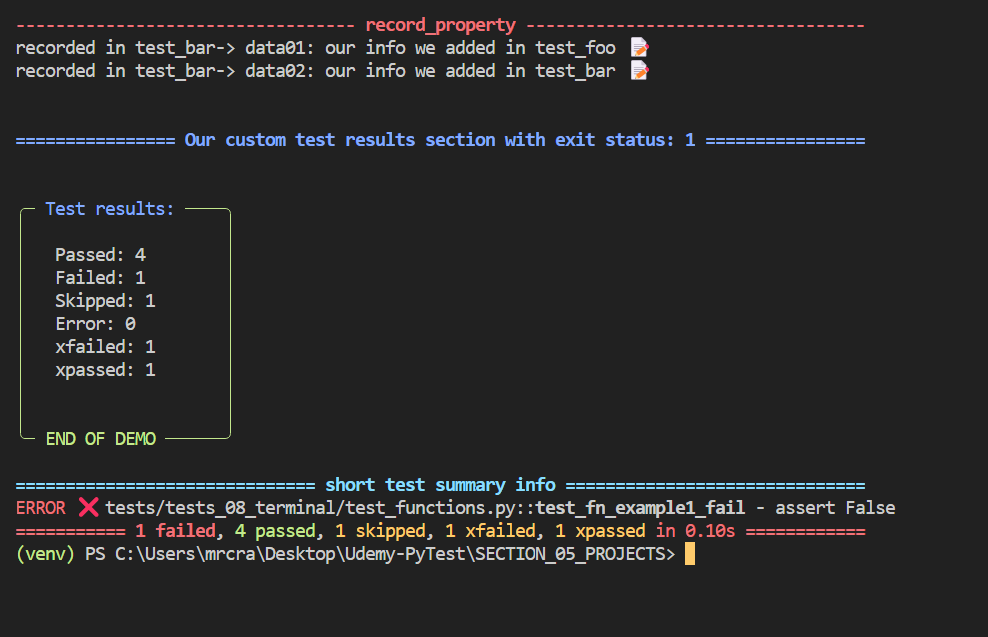

# The Pytest Cookbook - *recipes with videos and repos*

## Motivation

I really enjoy coming a across a resource that helps me understand a subject and that has a repo of the code that works 'out of the box' and additionally a video explainer rather than just an article.

I have created or collected such resources and combined them into a 'book', citing references where appropriate.

## Purpose of this book 

1. To provide a number of ready built and congfigurable FULL STACK PYTHON TEST FRAMEWORK, (PFS), comprising of over 200 highly commented test templates for developers to adapt to their own needs along with resource links that have helped me greatly, as well as integration of these into the frameworks.

2. To provide a curated source of articles and videos that surround PyTest, for example Docker, that enable 'out of the box' ease of use. Some are created by me, others reference with acknowledgments other sources.

## PyTest Full Stack, (PFS)

The PyTest Full Stack suite has an installation that will just require a 1-2-3 of:
   
1. `pip install -r requirements.txt`.
2. `playwright install` to load Playwright browsers.
3. `python -m pytest -v` to run over 200 tests.

PFS uses a number of PyTest hooks for utilities and features.

One of these is customising the terminal report and one can configure the output in a number of ways, explained in articles and videos.

Here is a sample output:

## Custom header sections

## Customised words, colours and icons

## Custom footer sections

The frameworks have logging and other utilities installed to provide a complete framework.

Resources included are:

1. Links to helpful articles, videos and documentation. 
2. Converted and transcribed code of great YT videos where there is no code repo.

## Test frameworks

*See the README.md in root of each test framework for detailed and up to date set up instructions.*

There are two main test frameworks:

- PyTest Full Stack - a full stack testing framework from SQL Schemas to E2E testing with Playwright
- PyTest Django Full Stack- is its own unique testing framework built from a range of sources. (Under construction and will be a PyTest-Full-Stack test suite for Django).

I strive to acknowledge sources I have used to learn PyTest and any adaptations of code samples used therein.

As a curated list of resources, I have integrity over linking to the work of others and due credits are given.

Often I am a wrapper around someone else's effort and I try to add a different presentation whre possible, as we often find our understanding with a different presentation of the subject. Hence having may teachers enables us all as eternal students to get our heads around sometimes very complex subjects.
<!-- 
## About me

I describe myself as a 'Freelance Backend Pythonista and Test Automation Engineer'.

I enjoy building Plugins and I have created a PyTest Hooks and Plugin online video course that teaches how to create lite versions of some well known plugins as well as our own useful custom plugins which can be made distributabe:

Example plugins are:

- CSV Lite Reporter
- Export results to DB
- Sorting, randomizing and deselecting tests
- Customising the console report with colors and icons

The course is available [Udemy Hooks and Plugins course](https://www.udemy.com/course/pytest-cookbook-using-hooks-to-create-custom-plugins/) and Udemy has a sale every two weeks and the cost would be $20 USD approx.

 -->

 