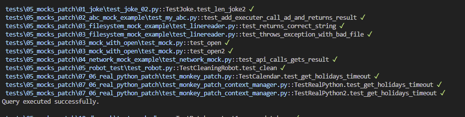

# The Pytest Cookbook - *recipes with videos and repos*

## Purpose of this book 

To provide a range of ready built and congfigured PYTHON TEST FRAMEWORKS comprising of test templates and references for developers to adapt to their own needs, requiring just a 1-2-3 of:
   
1. Create virtual environment
2. `pip install -r requirements.txt`
3. `python -m pytest` to see the output of all the tests as below:





The frameworks have logging and other utilities installed to provide a complete framework.

Resources included are:

1. Links to helpful articles, videos and documentation. Converted and transcribed code of great YT videos where there is no code.

2. A 'How do I...?' wiki of how to use PyTest and the frameworks.

## Test frameworks

*See the README.md in root of each Test framework for detailed and up to date set up instructions.*

These four are incremental, with each framework adding more functionality to the previous one:

- PyTest_00_MINIMAL - a basic src folder wired to PyTest with custom logging and pytest-sugar console formating.
- PyTest_01_PYTEST - as above but with a large number of ready made test templates demoing how to use PyTest along with templates for Mocking and Patching.
- PyTest_02_API - as above with API testing and Playwright e2e/functional testing.
- PyTest_03_BDD - as above with Behavior Driven testing that enables the use of native English test requirement files to be wired to PyTest and Behave Framework. BDD enables all stakeholders to work on these 'feature' test files in plain English which are then translated to Python test code.

The following are self-contained test frameworks and the tests can be easily added to the previous frameworks, but are self-contained for clarity and ease of use:

- PyTest_04_DB_TESTING - is a standalone test framework for testing database schemas such as foreigh keys, constraints, nullability etc. Uses SQLModel (SQLAlchemy + Pydantic) to inspect DB. Uses SQLite as test DB and this has some restricted schema information but there are tests for these.
- PyTest_05_DJANGO is its own unique testing framework built from a range of sources. 
- PyTest_06_HYPOTHESIS is a standalone property based test framework that can provide templates and resources on how to use property based testing. It can be thought of as very extensive parameter based testing to test edge cases and hone in on them.
- PyTest_087_HOOKS - a set of projects using the various hooks of PyTest with written explanations.
- PyTest_08_PLUGIN - an app tpo prodoce a distributable plugin of the 'lsort by test name' hook project as well as using PyTester to test the plugin itself.
- PyTest_09_CLI - testing a Typer CLI project.
- PyTest_10_CI_CD - a CI/CD example to show how we can use GitHub actions to test our code base on multiple Python versions and OS as well as uisng Tox to test our plugin across many Python versions.

## Authenticity

Whilst developing this book, I came across one of the best resources for PyTest - [pytest-with-eric.com](https://pytest-with-eric.com/). Combined with the PyTest book by [Brian Okken](https://pythontest.com/), they have helped me gain a deeper understanding of PyTest.

I strive to acknowledge sources I have used to learn PyTest and any adaptations of code samples used therein.

As a curated list of resources, I have integrity over linking to the work of others and due credits are given.

Often I am a wrapper around someone else's effort and I try to add a different presentation whre possible as we each find our understanding with a different presentation of the subject. Hence having may teachers enables us all as eternal students to get our heads around sometimes very complex subjects.

## About me

I am a Python Test Engineer using PyTest and Playwright as well as a Software Tester.

I enjoy building Plugins and I an developing a PyTest Hooks and Plugin online video course that teaches how to create lite versions of some well known plugins as well as our own useful custom plugins which can be made distributabe:

Example plugins are:

- CSV Lite Reporter
- Export results to DB
- Sorting, randomizing and deselecting tests

There is more information about me and my services [here](https://pytest-cookbook.netlify.app/craig/).

## How best to use this book

Download or git clone from [repo](https://github.com/Python-Test-Engineer/PYTHON-TEST-FRAMEWORK) and cd into the desired test framework.

Each test framework has a README.md and there are more details and information there as necessary. For the API and Playwright test framework, you will neeed to run `playwright install` after Playwright is installed to load all the browsers.

For prettier general console output, Rich and PyBoxen, built on Rich, are used as well as pytest-sugar for the test results.
file of test framework.

## YouTube Videos

I have made some videos to assist in using this book.

These are available [here](https://www.youtube.com/playlist?list=PLsszRSbzjyvkincV5XUzF9BeGsckrjb74){target="_blank"}.


==================================================================
## TODO

Django Tests

- https://www.photondesigner.com/articles/unit-tests-factory-boy-faker?ref=yt-unit-tests-factory-boy-faker

Testing middleware with `override_settings`

- https://www.youtube.com/watch?v=TTEEr4N-lKw


:flag_be: :heart: :arrow_right: 


```python
# Hello world example (Python)
print("Hello World!")
zero_to_
```

!!! note
 Example of a note.

!!! tip "Custom title"
 Example tip.