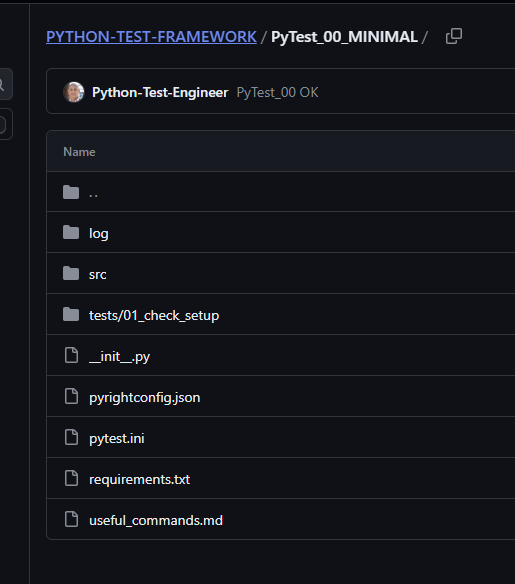

# PyTest_00_MINIMAL

## Set up

This uses PyTest_00_MINIMAL and is a simple wiring of src folder for your code and an tests folder for PyTest.

{:style="width:520px;border-radius:10%;border: 5px solid #555;"}

There is custom logging defined in pytest.ini that outputs to a `log` folder.

One of the tests `test_03_logging.py` uses logging in its tests.

- move to `PyTest_00_MINIMAL` folder and create a virtual environment, then install requirements.txt:

```
pip install -r requirements.txt
```

## Repo

👉 [ PyTest_00_MINIMAL](https://github.com/Python-Test-Engineer/PYTHON-TEST-FRAMEWORK/tree/main/PyTest_00_MINIMAL){target="_blank"}

## YT video

https://youtu.be/a3aXbukAvKI

## Contents

src/sample.py has a very simple function to test.

```
def add(a: int, b: int):
    """basic function"""
    return a + b
```
## Tests

There are a number to check everything is wired correctly as well as testing loggin and markers.

`pytest.ini` has settings for test locations, markers, logging format. Further information is added in the file.

pytest-sugar has been installed to provide prettier console output.

```
python -m pytest 

python -m pytest -vs
```

