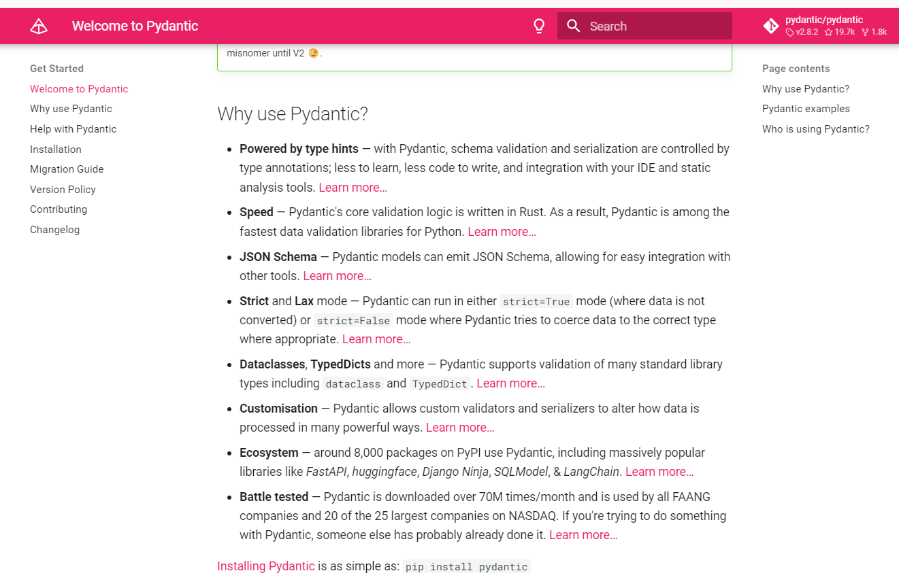

# Pydantic Data Transformation Services

"Today, Pydantic is downloaded many times a month and used by some of the largest and most recognisable organisations in the world.

It's hard to know why so many people have adopted Pydantic since its inception six years ago, but here are a few guesses."

*DESERIALIZATION === input string/dict/JSON data into Pydantic Python Models*

*SERIALIZATION === output data from Pydantic Python Model to string/dict/JSON data*

## Lifecycles

### Before

If we are importing in JSON for example, we can create aliases so that we can map firstName to first_name for example. We can also set rules for how Pydantic should handle extra fields.

We can also apply validation and data transformation prior to Pydantic carry out its own validataion, transformation and insertion.

### Pydantic validation

Our Pydantic model will validate data and return a list of errors that fail validation.

Pydantic does not stop on the first failed validation but continues on until all fields have been validated and it will then report a list of all validation errors.

### After

After Pydantic has run thorugh its own process, we can apply after validators/transformations prior to being inserted into the class.

### Serialization

When serialising, ('exporting'), we can set up rules for include/exclude fields depending on whether we are exporting to a Python dict or JOSN object.

## Ingesting a REST API

Using `https://dummyjson.com/users/3` we get a dictionary from our requests library.

- `01_user.py` - set up model level configuration and filter API for just a few fields.
- `02_user_composition.py` - we use nested models for our `address` field.
- `03_user_field_validation.py` - we apply field level validation/transformation on the `last_name` field and also demonstrate ordering of decorators where we use many on on field:

No matter what order the validators are lexcially defined in, the order is always Before first with furthest lexically first, then After with lexically nearest first.

### Repo

[https://github.com/Python-Test-Engineer/yt-pydantic-dts](https://github.com/Python-Test-Engineer/yt-pydantic-dts)

### YouTube Video

[https://www.youtube.com/playlist?list=PLsszRSbzjyvnRLSoGM3e-VspqImbWpXSL](https://www.youtube.com/playlist?list=PLsszRSbzjyvnRLSoGM3e-VspqImbWpXSL)

## Best course on Pydantic 

[https://www.udemy.com/course/pydantic](https://www.udemy.com/course/pydantic) and there is a very good YT video by him [https://www.youtube.com/watch?v=ok8bF8M7gjk](https://www.youtube.com/watch?v=ok8bF8M7gjk) which he also has a  repo for in the links.

 