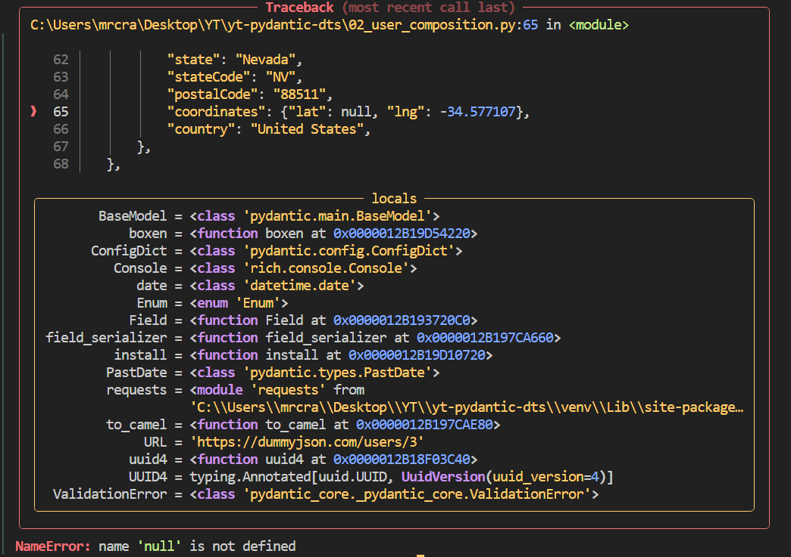

# Rich and Pyboxen

## Rich

We can format the console using a very powerful library, Rich [https://rich.readthedocs.io/en/latest/index.html](https://rich.readthedocs.io/en/latest/index.html).


```
from rich import print

print("Hello, [bold magenta]World[/bold magenta]!", ":vampire:", locals())
```


For a more pretty traceback:

```
from rich.traceback import install
install(show_locals=True)
```


A range of templates are available in Rich's GitHub repo [here](https://github.com/Textualize/rich/tree/master/examples).

## PyBoxen

PyBoxen is built on Rich and provides quick boxes - [https://github.com/savioxavier/pyboxen](https://github.com/savioxavier/pyboxen).

```
from pyboxen import boxen

print(
    boxen(
        "Titles and subtitles!",
        title="Hello, [black on cyan] World [/]",
        subtitle="Cool subtitle goes here",
        subtitle_alignment="center",
        color="yellow",
        padding=1,
    )
)
```


<br>