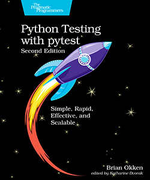

# Afterwards

## Cookbook

The cookbook covers many more items such as:

- Docker
- Asides on Mocking and Pluggy
- Toolbox for Console Prettying using Rich and PyBoxen, Allure reports, Visual Regression etc and I add more content as time passes.

## Revision 

[CoffeeBeforeArch](https://www.youtube.com/playlist?list=PLxNPSjHT5qvuZ_JT1bknzrS8YqLiMjNpS) and [Indian Pythonista](https://www.youtube.com/playlist?list=PLyb_C2HpOQSBWGekd7PfhHnb9GnqDgrxS) are very good concise walkthroughs of PyTest covering beginner to advanced topics.

## Development

[PyTestWithEric](https://pytest-with-eric.com/), has probably the best set of articles and repos covering beginner to advanced topics and I have created videos of them and incorporating the GitHub code to provide a second content delivery medium, explaining salient points.

Python Testing with pytest, Second Edition
Simple, Rapid, Effective, and Scalable
by Brian Okken

*The definitive book!*

[https://pragprog.com/titles/bopytest2/python-testing-with-pytest-second-edition/](https://pragprog.com/titles/bopytest2/python-testing-with-pytest-second-edition/)

## Online Hooks and Plugins

For an advanced look at these topics, I have my course hosted on Udemy:

The link and coupon code are available for the next 3 days: HERE

The course is available [Udemy Hooks and Plugins course](https://www.udemy.com/course/pytest-cookbook-using-hooks-to-create-custom-plugins/).

The repo contains heavily commented source files creating a sort of 'ebook' and is freely available [https://github.com/Python-Test-Engineer/Udemy-PyTest](https://github.com/Python-Test-Engineer/Udemy-PyTest). The video course add visual explanations and commentary.

## Reach out

I am contactable via the links at [pytest-cookbook.com.](https://pytest-cookbook.com/craig/contact/)

 