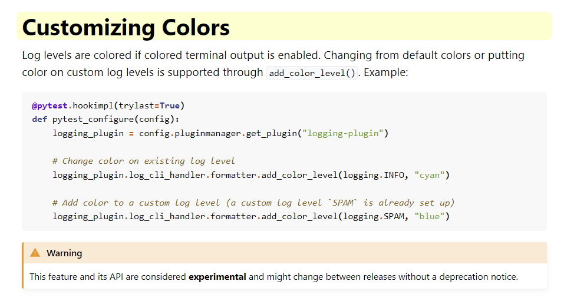

# Build from scratch

Note all we need to use pytest is a `tests`folder with test files `test_*.py` and pytest installed. This will enable us to do `python -m pytest` to run tests.

However, to build a framework we can add the following:

## SRC

Folder for one's source code - optional but recommended location by Python.

We will assume we have our `src` folder.

We can create a virtual environment with `python -m venv venv` followed byt activation:

- `.\venv\scripts\activate` for Windows
- `source venv/bin/activate` for Mac and Linux


## PyTest

Installation of `pytest` with `pip install pytest`.


## Playwright

Installation of Playwright`pip install playwright` and also `plyawright install` to load browsers for headed tests.

## Pytest.ini

Holds settings for PyTest.

We can use the one in PFS.

## Logging

Folder to store `pytest.log` file for logging messages as defined in `pytest.ini`.
```

# for log file - pytest uses these whenever logger used
log_file = log/pytesting.log # customise as required
log_file_level = INFO
log_file_format = %(asctime)s [%(levelname)8s] [%(name)s] %(message)s (%(filename)s:%(lineno)s)
log_file_date_format=%Y-%m-%d %H:%M:%S
```

In PFS, the logging location is `log` so we create this folder.

*For reference only:*

[https://docs.pytest.org/en/8.3.x/contents.html](https://docs.pytest.org/en/8.3.x/contents.html)



## Utils

Utility functions are stored in `utils`.

## Config

Folder that holds `*.ini` files or other config files. We create a `config` folder.

This can be useful as an alternative to CLI arguments. We can add our options in the config.ini file to be retrieved in our tests using the `read_config.py` file. 

This is standard Python.

## Results

Our custom CSV ouput files will go here based on the settings in the root `conftest.py` file, (near top of file), in the tests folder:

```
# ----- OUTPUT FILE AND LOCATION -----
report_date = datetime.now().strftime("%Y-%m-%d-%H-%M-%S")
# practically a GUID...
FILENAME = f"./results/report_{report_date}_{random.randint(1_000_000, 9_999_999)}.csv"
```

## Reports

These have reports from pytest-html and if we use this as our location for reports then they will be store here.

## htmlcov folder

Coverage report from pytest-cov can go here depending if we use `pytest --cov=htmlcov tests/`

## Screenshots

Folder to save captured screenshots from Playwright tests as configured in the Playwright test `test_08_download.py`. Location is customisable.

## Tests!

All our tests are stored in the `tests` folder.

We don't need to add `__init__.py` in this folder or subfolders but if we don't, we may have a test name collision if two tests have the same name.

<br>