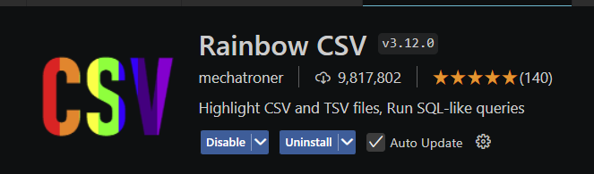
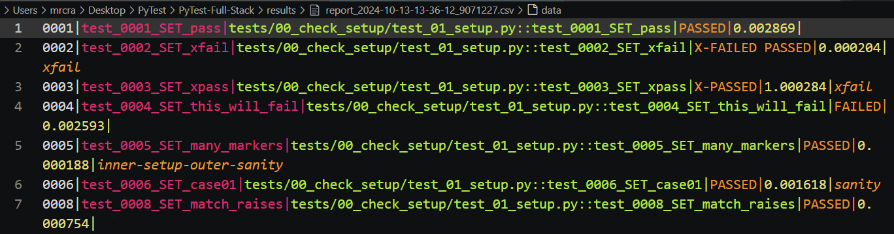

# Final Project, PFS

## Minimal Setup
Whilst PyTest and PFS have many features, a basic set up suffices:

- Install PyTest.
- Create a `tests` folder and module named `test_XXX.py` with test starting with `def test_`.
- Run `python -m pytest -v` (-m run as module, -v verbose).

I will demonstrate this with the BASIC example, stored in repo under `_notes`.

## Installation

We will start by downloading and setting up PFS so that you have a working final project to take away.

We will look at its structure and customisation and then move on to building it from scratch if necessary. Some of this may be done later in the workshop but we will see what we are able to do.

- `git clone https://github.com/Python-Test-Engineer/PyTest-Full-Stack`
- cd into folder `Pytest-Full-Stack'
- Create virtual enviroment `python -m venv venv`
- Activate your virtual enviromnent: Windows `.\venv\Scripts\activate` or Mac `source venv/bin/activate`.
- Install requirements with `pip install -r requirements.txt`.
- Run `playwright install` for Playwright browsers used primarily in E2E tests.
- There are around 200 templated tests.

## Rich and PyBoxen

I use Rich, (mostly), and PyBoxen, which is based on Rich to colorise console output.

More details at [https://pytest-cookbook.com/toolbox/rich_pyboxen/](https://pytest-cookbook.com/toolbox/rich_pyboxen/).

## Rainbow CSV

I use the Raibow CSV extension for colouring CSV files:

It is customisable and defaults to cuurent theme which for me is **Monokai Crete**.

## Test run

Let's run - run `python -m pytest -vs -n auto --headed` - there will be two intened FAILED tests.. 

The `-n auto` uses pytest-xdist to determine number of cores and split tests across them. One can set number of cores `-n 4` etc. 

Try running PFS without the -n flag or change the number of cores used.

The `--headed` tells Playwright to open up browsers in our E2E tests for demonstraion puposes. Generally, headless tests are used.

We can see a CSV of results in the `results` folder. The console ouput is colorised with the Rich library. Rename the `conftest.py` in the root of the folder to say `Xconftest.py` and you will see no CSV produced and no colorisation. 

This CSV output is a result of a local plugin that is in the `conftest.py`. It is a lite version of `pytest-csv` but has all necessary data.

We will look at `conftest.py` in PyTest 102 so for now we will just take a peek at this file without exlanations.

## Customisation

YouTube playlist: [Customise PFS](https://www.youtube.com/playlist?list=PLsszRSbzjyvlrB6V5dacW6G8YrD_iW7oy). It also has videos on the structure of PFS.

This covers:

- pytest.ini settings for logging.
- how to read values from the config.ini files in the config folder.
- customise the report header in the console output.
- customising the test status words, colours and icons in the console output.
- adding a report section at end of console output.
- and more...

The free online course 'PyTest Hooks and Plugins' that you will have a free coupon for goes into much more detail about how to use hooks in PyTest.

The link and coupon are in the **Afterwards** section.

 