# PyTest 101

## Test discovery

Before we look at the body of a test, we will first look at naming conventions of test function, classes, files and folders.

The default folder is `tests`. We can configure testpaths in `pytest.ini` for PyTest to search the listed folders:
```
testpaths =
    tests
    integration
```
Do we need `__init__.py` in `tests` folder/subfolders?

No. But if we don't and two tests have same name then there will be a name collision.

Using `__init__.py` will make each test have a unique namespace.

## Conventions

[https://docs.pytest.org/en/stable/example/pythoncollection.html](https://docs.pytest.org/en/stable/example/pythoncollection.html)

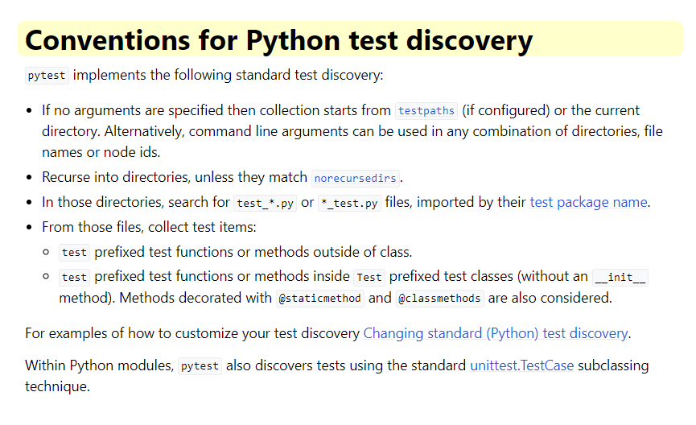

[https://docs.pytest.org/en/stable/explanation/goodpractices.html#conventions-for-python-test-discovery](https://docs.pytest.org/en/stable/explanation/goodpractices.html#conventions-for-python-test-discovery)

We can change default in `pytest.ini`:

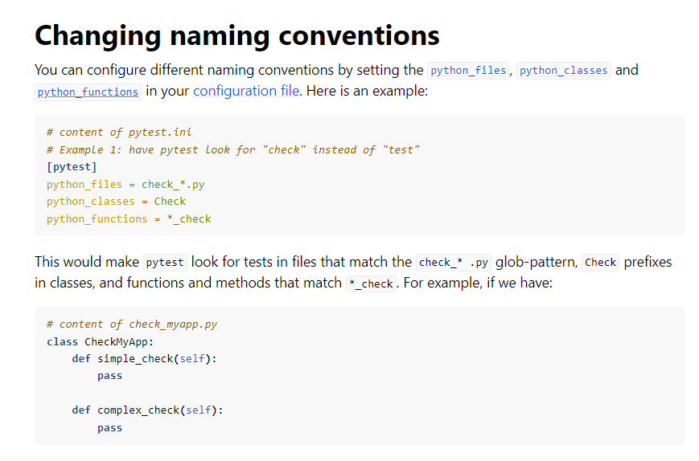


## Create a test

### Function based

If we have a function `src\some_function.py` and we want to test it, we can run this function within a test and PyTest will excute it and store results etc:

```
def test_some_function_works.py():
    actual_result = some_function()
    expecterd_result = "expected result values here"
    assert actual_result == expected_result, "(optional) output message if not equal"
```

### Class based

Using a class based test can group tests together and we can also apply PyTest features to the class and thus all the methods in it.

For discovery, both the class and methods must follow the naming convention whether default or custom.

(see above)

For class: Test*

For methods test_* or *_test

```
class TestSample:
    
    def test_0031_SET_add_num(self):
        """fn test in a class"""
        assert add(1, 2) == 3

    def test_0032_SET_add_num_will_fail(self):
        """failing fn test in a class"""
        console.print("[red italic]Example of failed test[/]⚠️")
        assert add(1, 2) == 5
```
## Run a test

To run tests we run `python -m pytest`. We can run just `pytest` but running it as a module adds the path to sys.path and can avoid any future issues.

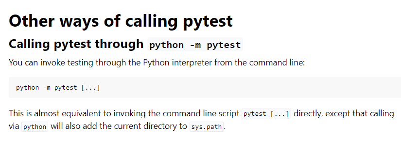
[https://docs.pytest.org/en/stable/how-to/usage.html#other-ways-of-calling-pytest](https://docs.pytest.org/en/stable/how-to/usage.html#other-ways-of-calling-pytest)

I use Rich and PyBoxen for console colouring. Some notes are here [https://pytest-cookbook.com/toolbox/rich_pyboxen/](https://pytest-cookbook.com/toolbox/rich_pyboxen/).

Let's run two tests, one PASSED and one FAILED...

In `00_check_setup\test_01_setup.py` there are two tests:

```
def test_0001_SET_pass():
    sleep(1)
    console.print("\n[blue bold]Testing Rich[/]\n")
    assert True

# A test fail to show as an example
def test_0004_SET_this_will_fail():
    console.print("[red italic]Example of a failed test[/]⚠️")
    assert False
```

A failed test with -v verbosity gives:
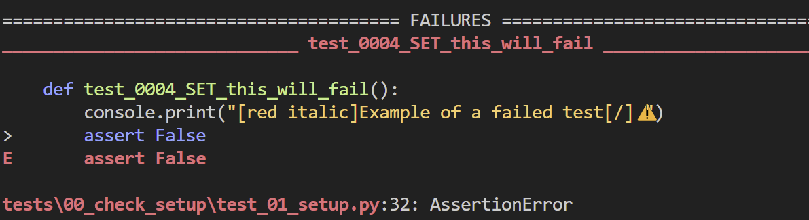

We will look at verbosity and outputs later...

We can run this easily with `python -m pytest -vs -k 0001` (-k is a 'like' and with unique test numbering it can be a convenient way to select a test, which we will dive into this deeper later...).

I will explain my test naming convention later...

## Selecting tests

### Locations

We can select tests by their location, module, class or function:

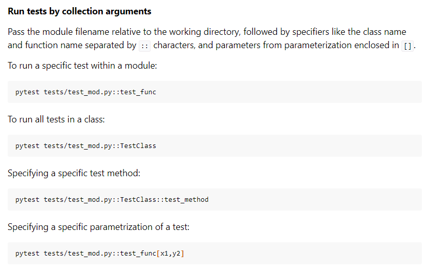
[https://docs.pytest.org/en/stable/how-to/usage.html#specifying-which-tests-to-run](https://docs.pytest.org/en/stable/how-to/usage.html#specifying-which-tests-to-run)

These are called nodes:

`python -m pytest .\tests\00_check_setup\test_01_setup.py`

`python -m pytest .\tests\00_check_setup\test_01_setup.py::test_0001_SET_pass`

`python -m pytest -vs .\tests\00_check_setup\test_04_class_based.py::TestSample::test_0031_SET_add_num`

### -k for 'like'

We can select test that are 'like' with the `-k` option:

`python -m pytest -k 0001 ` to select a specific id or

`python -m pytest -k SET` will select all those that contain 'SET' in test name.

We can combine 'not', 'or', 'and':

`python -m pytest -vs -k "0211 or 0212"` - note that single or double quotes are needed.

`python -m pytest -k "not SQL"` will get all tests that contain SET (case insensitive) or SQL. 

This can get tricky for more complex queries and in those case we will use 'markers' particularly as we can create dynamic markers that are based on Python list manipulation. We will se this later.


### @tests_to_run.txt

!!!To test

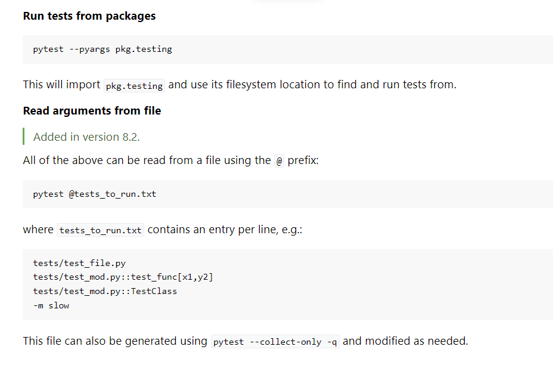

### Markers

#### Definition

Markers are 'tags' which we can add to tests using `@pytest.mark.tag_name` and we can then select a particular marker using `pytest -m pytest -m tag_name`.

They are decorators and they are syntactic sugar for passing a function to another function:

```
def make_pretty(func):

    def inner():
        print("I got decorated")
        func()
    return inner

@make_pretty
def ordinary():
    print("I am ordinary")

ordinary()  

This is actually:

ordinary = make_pretty(ordinary)

```

We can assign the name of the marker after @pytest.mark

```
import pytest

@pytest.mark.tag_name # needs to be imported
def test_use_marker_tag_name():
    assert True
```
Like the `-k` option, we can use add/or/not:

`python -m pytest -m 'outer or inner'`

#### Classes and modules

[https://docs.pytest.org/en/stable/example/markers.html#marking-whole-classes-or-modules](https://docs.pytest.org/en/stable/example/markers.html#marking-whole-classes-or-modules)

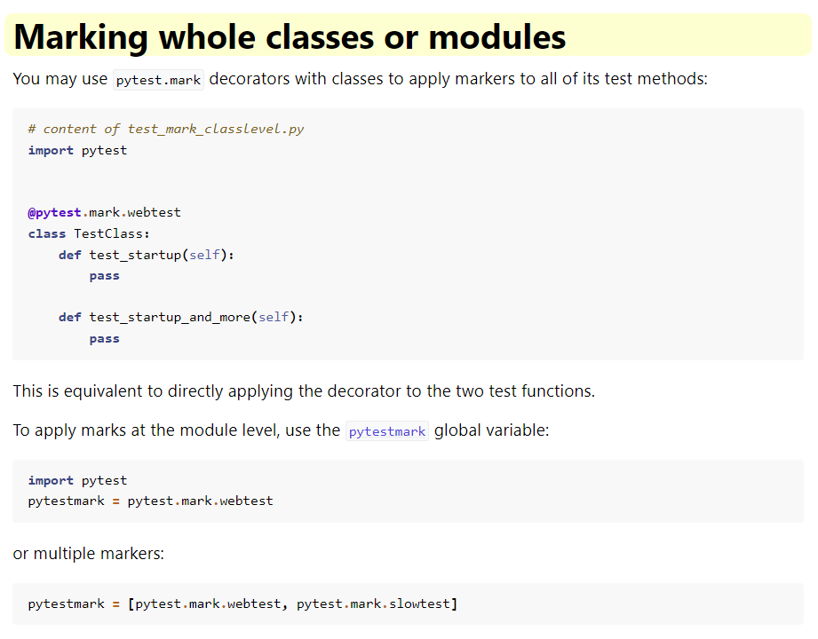

#### Registering

We do not need to register them with `pytest.ini` provided we do not have `--strict-markers` in `addopts`. If we do, we will get an error, if we don't we will get warnings.

In our `pytest.ini` we have:

```
markers =
    ;add markers of group tests - can use
    ; after colon is optional description
    setup: set up tests
    sanity: sanity tests
    mocks: all mocks
    joke_mocks: mocks for jokes
    add: test add
    inner_marker: an inner marker
    outer_marker: an outer marker
    outer
    inner
    deposit
    withdrawal
    banking
```

In this case above, if we have 
```
addopts = --strict-markers
```
then any markers not registered will cause an error.

#### Calling markers

If we run `python -m pytest -m sanity` we will get all those that have a marker of `sanity`.

We can also use `not`: `python -m pytest -m "not sanity"`

We can also mark a whole Class and all method tests within will be selected.

#### Multiple markers

Multiple markers: [https://github.com/pytest-dev/pytest/issues/6142](https://github.com/pytest-dev/pytest/issues/6142)

`python -m pytest -m "sanity or outer"` will select all tests with either `sanity` or `outer` as marks. It works in the same way as the `-k` flag and we can use `not` and `and`.

#### Dynamic markers

We will not discuss this yet but it is worth mentioning because managing 500+ test markers is best done dynamically...

We can use a hook `pytest_collect_modifyitems()`...

#### Built in markers

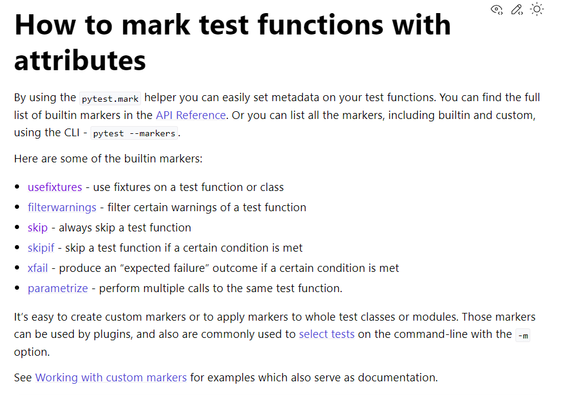

##### @pytest.mark.skip

Rather than comment out tests, we can mark them to be skipped and they will not be selected. 

##### @pytest.mark.skipif

We can skip conditionally:

```
@pytest.mark.skipif(
    sys.version_info > (3, 6), reason="Test requires Python version <= 3.6!"
)
```

##### @pytest.mark.xfail

We may have a test that we know will fail but we want to consider that a pass.

We can `xfail` the test and it will not result in a failed test but be marked as an `xfail`.

What if the `xfail` actually passes? We want to know this and it will be marked not as a fail but an `xpass` - unexepectedly passes.

There are examples of this in the set of tests we ran on PFS at start.

Some more detailed information is here: [https://docs.pytest.org/en/stable/how-to/skipping.html#xfail-mark-test-functions-as-expected-to-fail](https://docs.pytest.org/en/stable/how-to/skipping.html#xfail-mark-test-functions-as-expected-to-fail)

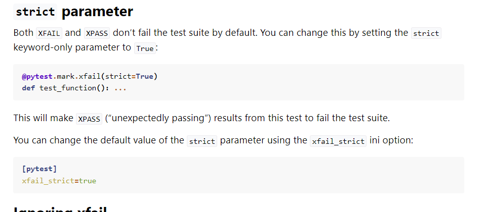

##### Markers for fixtures

We will cover this when we look at fixtures.

## Output options

[https://docs.pytest.org/en/8.2.x/how-to/output.html#managing-pytest-s-output](https://docs.pytest.org/en/8.2.x/how-to/output.html#managing-pytest-s-output)

```
pytest --showlocals     # show local variables in tracebacks
pytest -l               # show local variables (shortcut)
pytest --no-showlocals  # hide local variables (if addopts enables them)

pytest --capture=fd  # default, capture at the file descriptor level
pytest --capture=sys # capture at the sys level
pytest --capture=no  # don't capture
pytest -s            # don't capture (shortcut)
pytest --capture=tee-sys # capture to logs but also output to sys level streams

pytest --tb=auto    # (default) 'long' tracebacks for the first and last
                     # entry, but 'short' style for the other entries
pytest --tb=long    # exhaustive, informative traceback formatting
pytest --tb=short   # shorter traceback format
pytest --tb=line    # only one line per failure
pytest --tb=native  # Python standard library formatting
pytest --tb=no      # no traceback at all
```
We can run `python -m pytest -k 0004 --tb=no ` to see a failed test with various tracebck levels.

This may be useful when needed:
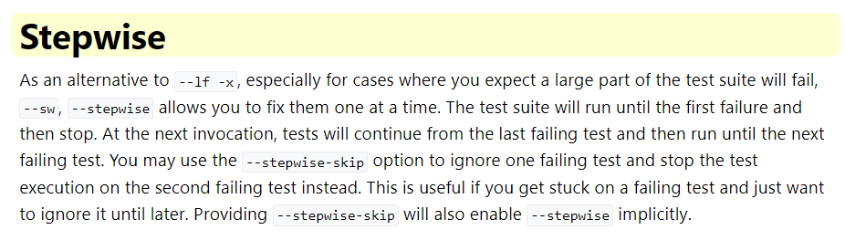
 
### Verbosity

We can use one of these flags for increasing verbosity:

-v, -vv, -vvv

### Console ouput

By default, PyTest suppresses console output to avoid 'clutter'.

If we want to use `print` statements, we need to use the `-s` flag. It can be combined with the `-v` flag `-vs` which is what I tend to use by default.

### -q for quiet

This means 'quiet'.

### ---durations

[https://docs.pytest.org/en/8.3.x/how-to/usage.html#profiling-test-execution-duration](https://docs.pytest.org/en/8.3.x/how-to/usage.html#profiling-test-execution-duration)

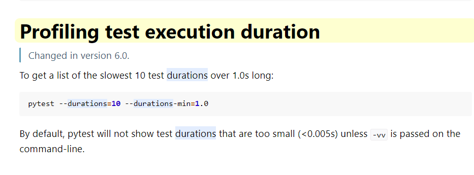

*NB We have our CSV report that gives duration for each test so that we can create our own 'durations' report.*

### -x ---maxfail

```
pytest -x            # stop after first failure
pytest --maxfail=2   # stop after two failures
```

### ---setup-show 

Used to see the order of execution.


### ---collectonly

This will show what tests will be run without running tess.

### -r for report

[https://docs.pytest.org/en/8.2.x/how-to/output.html#producing-a-detailed-summary-report](https://docs.pytest.org/en/8.2.x/how-to/output.html#producing-a-detailed-summary-report)

```
f - failed
E - error
s - skipped
x - xfailed
X - xpassed
p - passed
P - passed with output

Special characters for (de)selection of groups:

a - all except pP
A - all
N - none, this can be used to display nothing (since fE is the default)
```

If we run `pytestpython -m pytest .\tests\00_check_setup\ -rx` we get a short test summary at end of test run of just XFAIL:

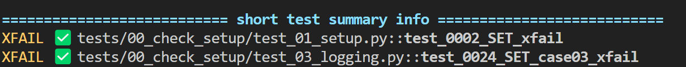

### CSV Outputs

[https://pytest-cookbook.com/pytest/pytest_test_management/](https://pytest-cookbook.com/pytest/pytest_test_management/) has more detail on test management and the use of a test naming convention.

We can use `pytest-csv` but our custom local plugin `conftest.py` can do this for us.

There is an explainer video for this and we will look at this a bit later and a sample line is:

```
0001|test_0001_SET_pass|tests/00_check_setup/test_01_setup.py::test_0001_SET_pass|PASSED|1.013291|
```

This is `test_id|test_name|test_node|result|duration`.

Given these details and the name of the CSV file containing the run_date and unique run_id, we can do a range of reports on our tests over many differing runs.

These can be loaded into and SQL DB to provide comprehensive analysis.

We can use other Python libraries to analyse and display this data.

### HTML Reports

We can also create an html report with `pytest-html`. A sample report is in the `reports` folder.

We can run this with `python -m pytest --html=reports/report.html --self-contained-html` (see COMMANDS.md in root folder).

### Coverage Reports

With `python -m pytest --cov-report html --cov .` (note end .) we get a coverage report as seen in the folder `htmlcov`.

There is a `.coverage` file created in the root of the project which requires processing, as done by the above command to give the folder `htmlcov` with an `index.html`.

<br>
