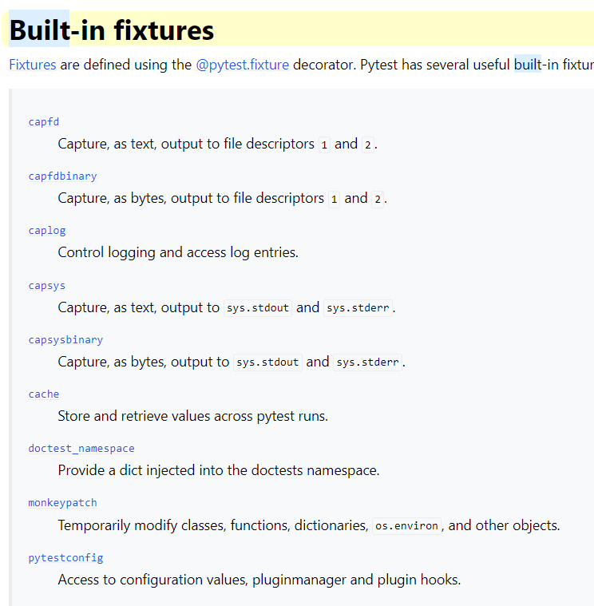
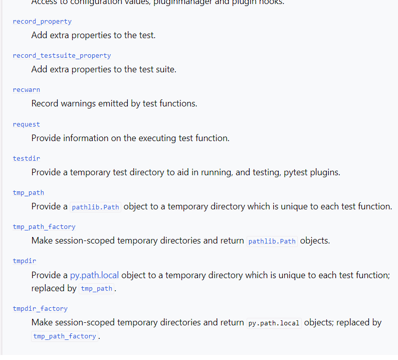
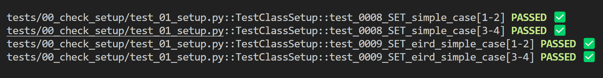
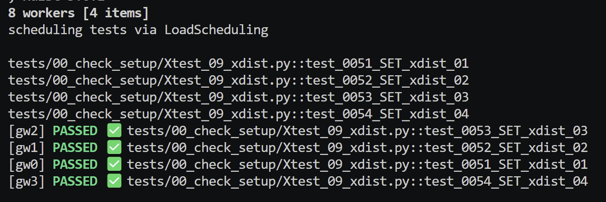

# PyTest 102

## Fixtures

### Definition

[https://docs.pytest.org/en/stable/explanation/fixtures.html](https://docs.pytest.org/en/stable/explanation/fixtures.html)

Fixtures are requested by test functions or other fixtures by declaring them as argument names.

They are an example of dependency injection and replace the setup/teardown features of Unit Test.

Fixtures can thus use other fixtures. They are Python functions and can be the arguments of other functions.

### Implementation

`tests\02_py_coffee\02_fixtures\00_basic_fixtures\test_fiztures_0.py` is an example:

```

@pytest.fixture
def initial_value():
    return 5

def square(num) :
    return num * num

# We pass in the fixture - dependency injection
def test_0240_FXT_square(initial_value):
    result = square(initial_value)
    assert result == initial_value**2
```

We can rename fixtures:

```
@pytest.fixture
def initial_value(name="custom_name"):
    return 5

def test_0240_FXT_square(custom_name)
    ...
```

### pytest --fixtures
`pytest --fixtures` is used to list available fixtures and where the fixture is located.

### setup/teardown

We can use `setup_method()` and `teardown_method()` as a simpler but less DRY alternative. See `tests\00_check_setup\test_04_src.py`.

### Yield and addfinalizer()

```
@pytest.fixture()
def my_object_fixture():
    print("Yielding fixture data...")
    yield MyObjectThatRequiresCleanUp()
    print("Do clean up after test has run...")
```

```
@pytest.fixture
def setup_data(request):
    # setup_data is now the fixture name we pass into our test...
    print("\nSetting up resources...")
    data = 22
    
    # Define a finalizer function for teardown
    def finalizer():
        print("\nPerforming teardown...")
        # Clean up any resources if needed

    # Register the finalizer to ensure cleanup
    request.addfinalizer(finalizer)

    return data  # Provide the data to the test
```

### Built in fixtures

There are many built in fixtures provided by PyTest but I only use a few of them:

[https://docs.pytest.org/en/stable/reference/fixtures.html#built-in-fixtures](https://docs.pytest.org/en/stable/reference/fixtures.html#built-in-fixtures)



Fixture availability is determined from the perspective of the test. A fixture is only available for tests to request if they are in the scope that fixture is defined in. If a fixture is defined inside a class, it can only be requested by tests inside that class. But if a fixture is defined inside the global scope of the module, then every test in that module, even if it’s defined inside a class, can request it.

## Conftest

`conftest.py` is automatically discovered and registered by PyTest. It is a good place to store fixtures so that they can be reused in the folder it is located in and any subfolders.

It does not need to be imported.

If a fixture appears in many `conftest.py` files then the closest `conftest.py` file to the test is used.

Example is: `02_py_coffee\02_fixtures\test_conftest_2` demonstrating that the closest `conftest.py` fixture value is used. 

## Parametrization

We may want to run a test for a range of values, e.g, we may want to test our `add()` for a range of values.

Rather than do some Pythonic looping over a test, we can use the `@pytest.mark.parametrize()` to decorate the test and supply our values in this decorator.

A decorator is a function that wraps another function and any values passed into the deocrator are available to the inner function by the closure created.

### Examples

- `tests\03_indian_pythonista\ip_04_parametrize\tests\test_sample.py`
- `python -m pytest -vs -k TestClassSetUp`

```
n and expected are variable names that take values of supplied list
@pytest.mark.parametrize("n, expected", [(1, 2), (3, 4)])
class TestClass:
    def test_simple_case(self, n, expected):
        assert n + 1 == expected

    def test_weird_simple_case(self, n, expected):
        assert (n * 1) + 1 == expected
```

### Output



### Options

There are a great many options available:


- Add ids for more human readable output.
- Using the indirect=True parameter when parametrizing a test allows to parametrize a test with a fixture receiving the values before passing them to a test.

## Customisation by hooks

## Plugins

These are some of the most common plugins.

xdist aside, we can recreate some of the functionality through the use of hooks. The online course 'PyTest Cookbook - Using hooks to create plugins' that you will have a free coupon for will go through this in much more details.

*It is easier than one might think!*

### pytest-csv

We already create our own cutomisable CSV output.

### pytest-html

### pytest-cov

Coverage is an important metric.

[https://pytest-with-eric.com/coverage/poetry-test-coverage/](https://pytest-with-eric.com/coverage/poetry-test-coverage/) is a very good example with code to illustrate the use of `pytest-cov`.

We can run `python -m coverage run -m pytest .\tests\01_inspect\ -vs` to run tests on a particular folder. This produces a `.coverage` in the root of the folder.

To create a report in the console, we can use `python -m coverage report -m` or `coverage report -m`.

To create an html report in `htmlcov` folder, we can use `python -m coverage html` and the report is `index.html`

We can omit tests using a `.coveragerc` file:

```
[run]
omit = 
    */tests/00_check_set_up/*
    ...
```

Some command line options:

```
--cov=src: Tells pytest-cov to measure coverage for the src folder.
--cov-report=term and --cov-report=html: Generate terminal and HTML coverage reports.
--cov-branch: Measures branch coverage as well as line coverage.
--cov-config=none: Specifies that no external config file will be read, but coverage will still run.
--cov-omit=src/legacy/*,src/migrations/*: Specifies the directories you want to omit from the coverage report.
``` 

[https://pytest-with-eric.com/coverage/python-coverage-omit-subfolder/](https://pytest-with-eric.com/coverage/python-coverage-omit-subfolder/) for more ways and deeper information.

### pytest-random

Ideally, all tests are independent of each other and randomising the order should not change the results of the test.

Randomising tests are a good way to test this.

### pytest-xdist

Using `python -m pytest -vs .\tests\00_check_setup\Xtest_09_xdist.py` with there being 4 tests in this test file, the overhead to set up 4 workers is around 2 seconds.

The file has X at beginning to avoid being called when we do a general pytest run as this would slow things down.

This does show how we can call any file for a test run. We just need `test_` etc if we want PyTest to discover the tests.



Running with n=1, the test took around 21s.
Running with n=4, the test took around 8s.
Running with n=8, the test took around 9s as there is overhead with managing workers.

There are plugins wich can split tests based on execution time based on previous runs, (which we have in our results.csv file).

<br> 