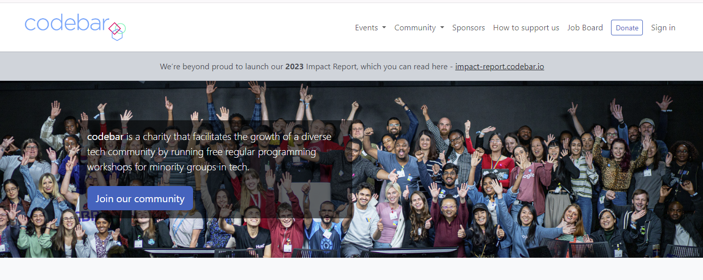
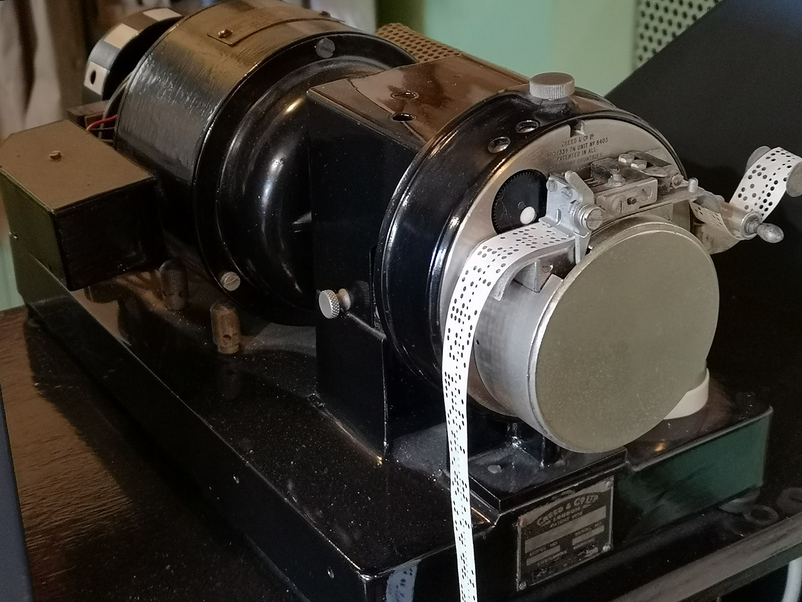

# Welcome

Welcome to the Getting Started with PyTest workshop.

There are a lot of resources both for the workshop and after so that you can feel * comfortable and confident* with PyTest.

## Who am I?

I am an 'adhoc' freelance Backend Pythonista and Test Automation Engineer living in Brighton, UK.

I am a volounteer coach at codebar.io/brighton and enjoy working in community kitchens, dog walking and partner dancing.

My first computer 1979

https://en.wikipedia.org/wiki/Punched_tape#/media/File:Creed_model_6S-2_paper_tape_reader.jpg

## Motivation

There are many great resources for PyTest and I wanted to curate them into one resource.

In my experience, I look for 3 things;

1. Good docs.
2. A repo that works out of the box.
3. Videos to explain concepts.

I hope PFS achieves this.

## Agenda

We will split the workshop into three sections:

### 1. PyTest Full Stack framework

Get familiar with all the resources availalbe and download Python Full Stack which is a complete framework for PyTest with over 200 template tests from SQL to E2E testing with Playwright. Learn how to create this framework from scratch and we will learn how to use it and run/select tests.

### 2. PyTest 101

- Create functional and class based test templates
- Test discovery
- Running tests
- Selecting tests with `-k` and markers
- Using built in markers to skip tests etc.
- Customise output options to CSV or HMTL reports
- Set up coverage reports

### 3. PyTest 102

We will look at PyTest features to make testing easier:

- Fixtures
- Parametrization
- Conftest.py
- Plugins

Resources available afterwards.

*My intention is for you to feel comfortable and confident with PyTest, ready to use and deepen your skillset from today.*

 

